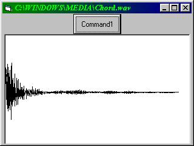

<div align="center">

## A  PIECE OF CODE FOR READING WAVE FILES


</div>

### Description

(Updates is on <a href="http://www.planet-source-code.com/xq/ASP/txtCodeId.26377/lngWId.1/qx/vb/scripts/ShowCode.htm">http://www.planet-source-code.com/xq/ASP/txtCodeId.26377/lngWId.1/qx/vb/scripts/ShowCode.htm</a>)

Fellow programmers. Ever wonder how one company's software reads a wave file and show it as a wave sample?<br><br>

This code demonstrated how you can read a wave file and DISPLAY it as a wave sample without using a single API! It opens a wave file (FOR RANDOM) to reads the so-call BINARY (ASCII) and draws the lines in a picture box according to the data in the file.<br>

Please note that the wave samples produces by this code are not as detail as those you found in some WAVE EDITOR.<br><br>

I'm still figuring out the wave format and try to play the sound. If you know a function that can play sections of a wave file, generate sounds at different volume and frequency or directly make the speakers (connected to the sound card) vibrate at different frequency and volume, please send me an E-mail...Thanks.
 
### More Info
 
Insert a command button, picture box and a common dialog box before running this code.

WAVE SAMPLES


<span>             |<span>
---                |---
**Submitted On**   |
**By**             |[Altis](https://github.com/Planet-Source-Code/PSCIndex/blob/master/ByAuthor/altis.md)
**Level**          |Advanced
**User Rating**    |4.8 (77 globes from 16 users)
**Compatibility**  |VB 5\.0, VB 6\.0
**Category**       |[Files/ File Controls/ Input/ Output](https://github.com/Planet-Source-Code/PSCIndex/blob/master/ByCategory/files-file-controls-input-output__1-3.md)
**World**          |[Visual Basic](https://github.com/Planet-Source-Code/PSCIndex/blob/master/ByWorld/visual-basic.md)
**Archive File**   |[](https://github.com/Planet-Source-Code/altis-a-piece-of-code-for-reading-wave-files__1-6694/archive/master.zip)


### Source Code

```
Option Explicit
Private Sub Command1_Click()
 Dim FileNumber As Integer
 Dim I As Single
 Dim Min As Single
 Dim Max As Single
 Dim Temp As Integer
 Dim XZoomrate As Single
 Dim YZoomrate As Single
 Dim LastX As Single
 Dim LastY As Single
 On Error GoTo ErrorHandler
 ' Enable Cancel error
 With Picture1
 CommonDialog1.CancelError = True
 CommonDialog1.Filter = "Wave files (*.wav)|*.wav"
 CommonDialog1.ShowOpen
 ' Change the caption of the form
 Me.Caption = CommonDialog1.filename
 I = 44 ' Set I To 44, since the wave sample is begin at Byte 44.
 ' Open file to get the length of the wav
 ' e file.
 FileNumber = FreeFile
 Open CommonDialog1.filename For Random As #FileNumber
 Do
  Get #FileNumber, I, Temp
  I = I + 1
  ' Get the smallest and largest number. T
  ' hey will be use for the adjustment
  ' of the vertical size.
  If Temp < Min Then Min = Temp
  If Temp > Max Then Max = Temp
 Loop Until EOF(FileNumber)
 Close #FileNumber
 ' Adjust values and reset values
 XZoomrate = (.Width / I)
 YZoomrate = (Max - Min) / (.Height / 2)
 .CurrentX = 100
 .CurrentY = .Height / 2
 LastX = 100
 LastY = .Height / 2
 .AutoRedraw = True
 I = 44
 ' Reopen file using a different FileNumb
 ' er
 FileNumber = FileNumber + 1
 .Cls
 Open CommonDialog1.filename For Random As #FileNumber
 Do
  Get #FileNumber, I, Temp
  ' Set CurrentX and CurrentY
  .CurrentX = .CurrentX + XZoomrate
  .CurrentY = (Temp / YZoomrate) + .Height / 2
  ' Plot graph
  Picture1.Line (LastX, LastY)-(.CurrentX, .CurrentY), vbBlack
  ' Reset values
  LastX = .CurrentX
  LastY = .CurrentY
  I = I + 1
  If .CurrentX > .Width Then Exit Do
 Loop Until EOF(FileNumber)
 Close #FileNumber
 End With
ErrorHandler:
 ' Do nothing
End Sub
Private Sub Form_Resize()
 On Error Resume Next
 ' Resize control
 With Picture1
 .BackColor = vbWhite
 .ForeColor = vbBlack
 .Move 50, 500, Width - 200, Height - 800
 End With
End Sub
```

